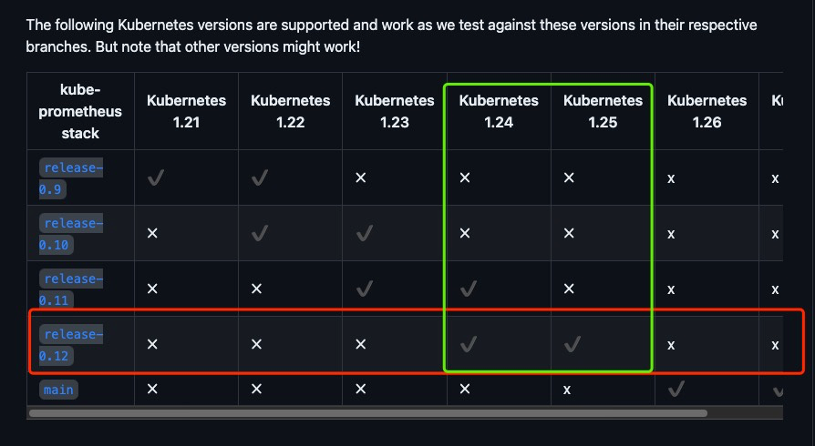
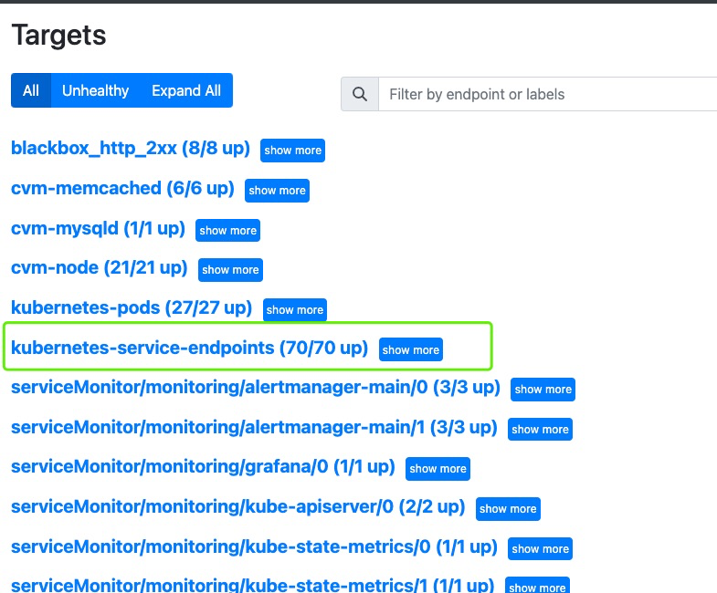

# 安装kube-prometheus

#### [kube-prometheus官网](https://github.com/prometheus-operator/kube-prometheus/tree/release-0.12) 

## 前提：

### * 注意：所有 "{ Domain }" 替换成自己的域名

###### 安装版本：kube-prometheus: release-0.12
###### k8s环境：小于1.26，大于等于1.24
###### * 其他版本也是相对的，基本上变动都不大，参考本文也能正常部署

##### 安装kube-prometheus是独立节点【prometheus会占用比较多的资源，为了不影响业务】

#### * 说明：
```
# kubernetes 安装kube-prometheus的node节点
监控专用节点名：node-monitoring

## node标签：
$ kubectl label nodes node-monitoring nodeRole=monitoring

### yaml标签配置：
  nodeSelector:
    nodeRole: monitoring

## node污点：
$ kubectl taint nodes node-monitoring node-role.kubernetes.io/prometheus=monitoring:NoSchedule

### yaml容忍度配置：
  tolerations:
  - effect: NoSchedule
    key: node-role.kubernetes.io/prometheus
    value: monitoring
    operator: Equal
```


##### kube-prometheus每个分支支持的kubernetes版本



## 安装kube-prometheus
```shell
# 创建kube-prometheus工作目录
$ mkdir -p /data/k8s-prometheus
$ cd /data/k8s-prometheus

# 拉取release-0.12分支代码
$ git clone -b release-0.12 https://github.com/prometheus-operator/kube-prometheus.git

# 切换工作目录
$ cd kube-prometheus/manifest

# 注意：
# blackboxExporter-networkPolicy.yaml, grafana-networkPolicy.yaml, alertmanager-networkPolicy.yaml
# prometheusAdapter-apiService.yaml，kubeStateMetrics-deployment.yaml
# 不需要提交，重命名
$ mv blackboxExporter-networkPolicy.yaml{,.bak}
$ mv grafana-networkPolicy.yaml{,.bak}
$ mv alertmanager-networkPolicy.yaml{,.bak}
$ mv prometheusAdapter-apiService.yaml{,.bak}

# 修改组件配置，修改prometheus组件的nodeSelector，将prometheus绑定到monitoring节点上
$ vim prometheus-prometheus.yaml
# 修改nodeSelector：
  nodeSelector:
    nodeRole: monitoring
# 在spec属性下面添加容忍度：
  tolerations:
  - effect: NoSchedule
    key: node-role.kubernetes.io/prometheus
    value: monitoring
    operator: Equal

# 创建资源
$ kubectl create -f setup/
$ kubectl create -f .

# 安装完成后查看状态是否正常
$ kubectl get pod -n monitoring
```


## 配置ingresses
```shell
# 创建ingresses工作目录
$ mkdir ingress
$ cd ingress

# 安装htpasswd
$ yum -y install httpd-tools

# 创建auth文件
$ htpasswd -c auth admin
# 提示：笔者这里密码为：123456

# 创建basic认证的secrets
$ kubectl create -n monitoring secret genric basic-auth --from-file=auth

# 创建域名SSL证书TLS secret  换成自己的域名证书
kubectl create -n monitoring secret tls { Domain }-secret --key=tls.key --cert=tls.crt

# 配置ingress
# grafana-ingress.yaml
$ cat << 'EOF' | tee grafana-ingress.yaml
apiVersion: networking.k8s.io/v1
kind: Ingress
metadata:
  name: grafana
  namespace: monitoring
  annotations:
    nginx.ingress.kubernetes.io/use-regex: "true"
    nginx.ingress.kubernetes.io/ssl-redirect: "true"
spec:
  tls:
  - hosts:
    - grafana.{ Domain }
    secretName: { Domain }-secret
  rules:
  - host: grafana.{ Domain }
    http:
      paths:
      - path: /
        pathType: Prefix
        backend:
          service:
            name: grafana
            port:
              number: 3000
EOF

# prometheus-ingress.yaml
$ cat << 'EOF' | tee prometheus-ingress.yaml
apiVersion: networking.k8s.io/v1
kind: Ingress
metadata:
  name: prometheus-k8s
  namespace: monitoring
  annotations:
    nginx.ingress.kubernetes.io/use-regex: "true"
    nginx.ingress.kubernetes.io/ssl-redirect: "true"
    nginx.ingress.kubernetes.io/auth-type: basic
    nginx.ingress.kubernetes.io/auth-secret: basic-auth
spec:
  tls:
  - hosts:
    - prometheus.{ Domain }
    secretName: { Domain }-secret
  rules:
  - host: prometheus.{ Domain }
    http:
      paths:
      - path: /
        pathType: Prefix
        backend:
          service:
            name: prometheus-k8s
            port:
              number: 9090
EOF

# alertmanager-ingress.yaml
$ cat << 'EOF' | tee alertmanager-ingress.yaml
apiVersion: networking.k8s.io/v1
kind: Ingress
metadata:
  name: alertmanager-main
  namespace: monitoring
  annotations:
    nginx.ingress.kubernetes.io/use-regex: "true"
    nginx.ingress.kubernetes.io/ssl-redirect: "true"
    nginx.ingress.kubernetes.io/auth-type: basic
    nginx.ingress.kubernetes.io/auth-secret: basic-auth
spec:
  tls:
  - hosts:
    - alertmanager.{ Domain }
    secretName: { Domain }-secret
  rules:
  - host: alertmanager.{ Domain }
    http:
      paths:
      - path: /
        pathType: Prefix
        backend:
          service:
            name: alertmanager-main
            port:
              number: 9093
EOF

# 提交ingress资源
kubectl create -f .

# 提交ingress资源后查看
kubectl -n get ingress

# 退出工作
cd ..

```


## 配置kube-prometheus
```shell
# 配置Prometheus --web.external运行参数为对外访问的链接
$ vim prometheus-prometheus.yaml
# 在spec属性中添加一行
spec:
  ...
  externalUrl: https://prometheus.{ Domain }/

# 配置AlertManager的--web.external运行参数为对外访问的链接
$ vim alertmanager-alertmanager.yaml
# 在spec属性中添加一行
spec:
  ...
  externalUrl: https://prometheus.{ Domain }/

# 重新提交prometheus，alertmanage
$ kubectl apply -f prometheus-prometheus.yaml -f alertmanager-alertmanager.yaml


# 配置prometheus RBAC鉴权，监控所有命名空间 prometheus-clusterRole.yaml
$ cat << 'EOF' | tee prometheus-clusterRole.yaml
apiVersion: rbac.authorization.k8s.io/v1
kind: ClusterRole
metadata:
  labels:
    app.kubernetes.io/component: prometheus
    app.kubernetes.io/instance: k8s
    app.kubernetes.io/name: prometheus
    app.kubernetes.io/part-of: kube-prometheus
    app.kubernetes.io/version: 2.41.0
  name: prometheus-k8s
rules:
- apiGroups:
  - ""
  resources:
  - nodes/metrics
  verbs:
  - get
- apiGroups:
  - ""
  resources:
  - services
  - endpoints
  - pods
  verbs:
  - get
  - list
  - watch
- nonResourceURLs:
  - /metrics
  verbs:
  - get
EOF

# 重新提交prometheus-clusterRole.yaml资源
$ kubectl apply -f prometheus-clusterRole.yaml


# 配置prometheus存储，持久化数据，数据保留时长以及资源限制
$ vim prometheus-prometheus.yaml
# 在spec属性中添加以下配置
spec:
  ...
  retention: 30d                # 监控数据保留30天
  storage:                      # 存储配置
    volumeClaimTemplate:
      spec:
        storageClassName: nfs-default   # 配置storageclass，nfs-default
        resources:
          requests:
            storage: 300Gi
# 在原resources资源限制属性
  resources:
    requests:
      memory: 400Mi
# 中增加如下limits属性[根据实际情况限制limits，建议4核8G以上的配置]
    limits:
      cpu: 3900m
      memory: 9216Mi

# 配置Alertmanager存储，持久化数据，数据保留时长
$ vim alertmanager-alertmanager.yaml
# 在spec属性中添加以下配置
spec:
  ...
  retention: 720h               # 注意，这里最大的单位是h,没有d。
  storage:                      # 存储配置
    volumeClaimTemplate:
      spec:
        storageClassName: nfs-default   # 配置storageclass，nfs-default
        resources:
          requests:
            storage: 100Gi

# 配置grafana存储，持久化数据，资源限制
# 首先yaml文件的最前面添加pv、pvc的yaml，创建磁盘挂载卷
$ cat << 'EOF' | tee grafana-pvc.yaml
apiVersion: v1
kind: PersistentVolumeClaim
metadata:
  finalizers:
  - kubernetes.io/pvc-protection
  name: grafana-pvc
  namespace: monitoring
spec:
  accessModes:
  - ReadWriteMany
  storageClassName: nfs-default
  resources:
    requests:
      storage: 100Gi
EOF

# 修改grafana挂载pvc
$ vim grafana-deployment.yaml
# 修改PVC磁盘挂载
      volumes:
      - emptyDir: {}
        name: grafana-storage
# 为
      volumes:
      - name: grafana-storage
        persistentVolumeClaim:
          claimName: grafana-pvc
# 修改原limits资源限制为
        resources:
          limits:
            cpu: 1
            memory: 1Gi

# 提交变更资源
$ kubectl apply -f prometheus-prometheus.yaml -f alertmanager-alertmanager.yaml -f grafana-pvc.yaml -f grafana-deployment.yaml


# 修改kkube-state-metrics可搜集自定的label标签
$ vim kubeStateMetrics-deployment.yaml
# 在kube-state-metrics容器中args位置最后的参数后添加
        - --metric-labels-allowlist=pods=[*],nodes=[node,failure-domain.beta.kubernetes.io/zone,topology.kubernetes.io/zone]

# 重新提交资源
$ kubectl apply -f kubeStateMetrics-deployment.yaml


# 创建Operator自动发现配置
$ cat << 'EOF' | sudo tee prometheus-additional.yaml
- job_name: 'kubernetes-service-endpoints'
  kubernetes_sd_configs:
  - role: endpoints
  relabel_configs:
  - source_labels: [__meta_kubernetes_service_annotation_prometheus_io_scrape]
    action: keep
    regex: true
  - source_labels: [__meta_kubernetes_service_annotation_prometheus_io_scheme]
    action: replace
    target_label: __scheme__
    regex: (https?)
  - source_labels: [__meta_kubernetes_service_annotation_prometheus_io_path]
    action: replace
    target_label: __metrics_path__
    regex: (.+)
  - source_labels: [__address__, __meta_kubernetes_service_annotation_prometheus_io_port]
    action: replace
    target_label: __address__
    regex: ([^:]+)(?::\d+)?;(\d+)
    replacement: $1:$2
  - action: labelmap
    regex: __meta_kubernetes_service_label_(.+)
  - source_labels: [__meta_kubernetes_namespace]
    action: replace
    target_label: namespace
  - source_labels: [__meta_kubernetes_service_name]
    action: replace
    target_label: service
  - source_labels: [__meta_kubernetes_pod_name]
    action: replace
    target_label: pod
EOF

# 创建自动发现配置secret
$ kubectl create secret generic additional-configs --from-file=prometheus-additional.yaml -n monitoring

# 在prometheus中添加自动发现配置的secret
$ vim prometheus-prometheus.yaml
# 添加如下内容：
  additionalScrapeConfigs:
    name: additional-configs
    key: prometheus-additional.yaml

# 重新提交资源清单
$ kubectl apply -f prometheus-prometheus.yaml

# 之后prometheus会自动载入配置，可进入prometheus web的配置页面验证。
```
之后prometheus会自动载入配置，可进入prometheus web的配置页面验证。如下图示：




## 配置kube-prometheus域名可用检查
```shell
# 配置http，https检查
# 清理自带的blackboxExporter config和deployment
$ kubectl delete -f blackboxExporter-configuration.yaml -f blackboxExporter-deployment.yaml

# 创建工作目录并切换到工作目录
$ mkdir -p blackbox-exporter
$ cd blackbox-exporter

# 创建blackbox-exporter-config配置
$ cat << 'EOF' | tee blackbox-exporter-config.yml 
apiVersion: v1
kind: ConfigMap
metadata:
  name: blackbox-exporter-config
data:
  config.yml: |
    modules:
      http_2xx:
        prober: http
      http_post_2xx:
        prober: http
        http:
          method: POST
      tcp_connect:
        prober: tcp
      pop3s_banner:
        prober: tcp
        tcp:
          query_response:
          - expect: "^+OK"
          tls: true
          tls_config:
            insecure_skip_verify: false
      ssh_banner:
        prober: tcp
        tcp:
          query_response:
          - expect: "^SSH-2.0-"
      irc_banner:
        prober: tcp
        tcp:
          query_response:
          - send: "NICK prober"
          - send: "USER prober prober prober :prober"
          - expect: "PING :([^ ]+)"
            send: "PONG ${1}"
          - expect: "^:[^ ]+ 001"
      icmp:
        prober: icmp
EOF

# 创建blackbox-exporter-deploy 资源清单
$ cat << 'EOF' | sudo tee blackbox-exporter-deploy.yaml
apiVersion: v1
kind: Service
metadata:
  name: blackbox-exporter
  labels:
    app: blackbox-exporter
  # 监控metrics端口
  annotations:
    prometheus.io/scrape: "true"
    prometheus.io/port: "9115"
spec:
  type: ClusterIP
  ports:
  - name: metrics
    protocol: TCP
    port: 9115
    targetPort: metrics
  selector:
    app: blackbox-exporter
---
apiVersion: apps/v1
kind: Deployment
metadata:
  name: blackbox-exporter
spec:
  selector:
    matchLabels:
      app: blackbox-exporter
  replicas: 2
  minReadySeconds: 2
  template:
    metadata:
      labels:
        app: blackbox-exporter
    spec:
      containers:
      - name: metrics
        image: prom/blackbox-exporter:v0.16.0
        imagePullPolicy: IfNotPresent
        ports:
        - name: metrics
          containerPort: 9115
          protocol: TCP
        volumeMounts:
        - name: config
          mountPath: /etc/blackbox_exporter
      volumes:
      - name: config
        configMap:
          name: blackbox-exporter-config       
EOF

# 提交blackbox资源
$ kubectl -n monitoring apply -f blackbox-exporter-config.yml -f blackbox-exporter-deploy.yaml

```
