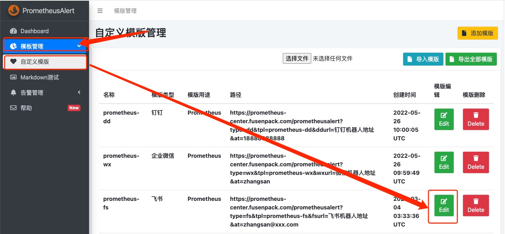
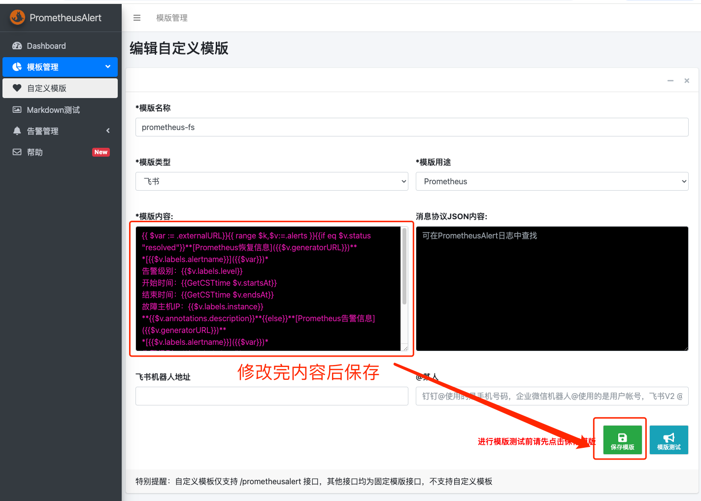

## 部署prometheus2.49

prometheus一个高效的监控数据存储的组件，可以配置主动发现监控信息

服务器与组件

| hostname   | ip           | assembly          | version | usefulness |
|------------|--------------|-------------------|---------|------------|
| prometheus | 172.31.27.65 | prometheus        | 2.49    | prometheus |
| prometheus | 172.31.27.65 | alertmanager      | 0.26.0  | 告警管理       |
| prometheus | 172.31.27.65 | PrometheusAlert   | 4.9     | 告警发送中心     |
| prometheus | 172.31.27.65 | blackbox_exporter | 4.9     | 域名检测       |
| prometheus | 172.31.27.65 | nginx             | 4.9     | 代理         |
| prometheus | 172.31.27.65 | grafana           | 4.9     | dashboard  |

下载相关组件资源
```shell
# 创建下载目录
mkdir ~/src && cd ~/src

# prometheus
wget https://github.com/prometheus/prometheus/releases/download/v2.49.1/prometheus-2.49.1.linux-amd64.tar.gz

# alertManager
wget https://github.com/prometheus/alertmanager/releases/download/v0.26.0/alertmanager-0.26.0.linux-amd64.tar.gz

# blackbox-exporter
wget https://github.com/prometheus/blackbox_exporter/releases/download/v0.24.0/blackbox_exporter-0.24.0.linux-amd64.tar.gz

# PrometheusAlert
wget https://github.com/feiyu563/PrometheusAlert/releases/download/v4.9/linux.zip

# 设置安装目录并创建
export WORKER_DIR="/mnt/data"
mkdir -p $WORKER_DIR
```

## 安装

### 部署prometheus

```shell
# 切换到包目录
cd ~/src

# 解压到工作目录
tar -xf prometheus-2.49.1.linux-amd64.tar.gz -C $WORKER_DIR

# prometheus目录重命名
mv $WORKER_DIR/prometheus-2.49.1.linux-amd64 $WORKER_DIR/prometheus

# 创建所需目录
mkdir -p $WORKER_DIR/prometheus/{config,rules,targets}

# 创建prometheus配置
cat > $WORKER_DIR/prometheus/config/prometheus << EOF
PROMETHEUS_CONFIG='--config.file=$WORKER_DIR/prometheus/prometheus.yml --storage.tsdb.path=$WORKER_DIR/prometheus/data --storage.tsdb.retention.time=90d --log.level=info'
EOF
```

### 部署alertmanager

# 安装
```shell
# 切换到包目录
cd ~/src

# 解压到工作目录
tar -xf alertmanager-0.26.0.linux-amd64.tar.gz -C $WORKER_DIR

# alertmanager目录重命名
mv $WORKER_DIR/alertmanager-0.26.0.linux-amd64 $WORKER_DIR/alertmanager

# 创建所需目录
mkdir -p $WORKER_DIR/alertmanager/config

# 创建alertmanager配置
cat > $WORKER_DIR/alertmanager/config/alertmanager << EOF
ALERTMANAGER_CONFIG='--web.listen-address=:9093
 --config.file=/mnt/data/alertmanager/alertmanager.yml'
EOF
```

### 部署PrometheusAlert

```shell
# 切换到包目录
cd ~/src

# 解压PrometheusAlert
unzip linux.zip

# PrometheusAlert重命名
mv linux $WORKER_DIR/PrometheusAlert
```

### 部署grafana
```shell
sudo apt-get install -y apt-transport-https software-properties-common wget
sudo mkdir -p /etc/apt/keyrings/
wget -q -O - https://apt.grafana.com/gpg.key | gpg --dearmor | sudo tee /etc/apt/keyrings/grafana.gpg > /dev/null
echo "deb [signed-by=/etc/apt/keyrings/grafana.gpg] https://apt.grafana.com stable main" | sudo tee -a /etc/apt/sources.list.d/grafana.list
# Updates the list of available packages
sudo apt-get update
# Installs the latest OSS release:
sudo apt-get install grafana
```

### 部署nginx，supervisor
```shell
apt update && apt install -y nginx supervisor
```


## 配置

### 配置Nginx
```shell
# 创建nginx所需目录
mkdir -p /etc/nginx/{vhost,ssl}

# 切换工作目录
cd /etc/nginx
# 生成nginx验证
htpasswd -c .htpasswd admin # 提示笔者密码设置为：123456
> New password:
> Re-type new password:
> Adding password for user admin

# nginx主配置
cp /etc/nginx/nginx.conf{,.default}
cat << 'EOF' | sudo tee /etc/nginx/nginx.conf
user www-data www-data;
worker_processes 8;
error_log  /var/log/nginx/nginx_error.log;
pid  /var/run/nginx.pid;
worker_rlimit_nofile 102400;
include /etc/nginx/modules-enabled/*.conf;

events {
    use epoll;
    worker_connections  102400;
}

http {
	include /etc/nginx/mime.types;
	default_type application/octet-stream;

    server_names_hash_bucket_size 128;
    client_header_buffer_size 64k;
    client_body_buffer_size 128k;
    large_client_header_buffers 4 128k;
    client_max_body_size 50m;
    types_hash_max_size 2048;

    sendfile on;
    tcp_nopush     on;
    keepalive_timeout 60;
    tcp_nodelay on;
    server_tokens off;

    proxy_connect_timeout 300;
    proxy_send_timeout 100;
    proxy_read_timeout 200;
    proxy_buffer_size 128k;
    proxy_buffers 8 256k;
    proxy_hide_header X-Powered-By;  # 隐藏Nginx后端服务指定Header的状态
    proxy_hide_header Server;        # 隐藏Nginx后端服务指定Header的状态
    ssl_protocols TLSv1 TLSv1.1 TLSv1.2 TLSv1.3; # Dropping SSLv3, ref: POODLE
	ssl_prefer_server_ciphers on;

    gzip on;
    gzip_min_length  1k;
    gzip_buffers     4 16k;
    gzip_http_version 1.1;
    gzip_comp_level 2;
    gzip_types  text/plain  text/css  application/xml application/x-javascript ;

    fastcgi_connect_timeout 300;
    fastcgi_send_timeout 300;
    fastcgi_read_timeout 300;
    fastcgi_buffer_size 256k;
    fastcgi_buffers 4 256k;
    fastcgi_busy_buffers_size 256k;
    fastcgi_temp_file_write_size 256k;

    # 配置socket所需
    map $http_upgrade $connection_upgrade {
        default upgrade;
        '' close;
    }

    #proxy_temp_path   /usr/local/nginx/temp;
    #proxy_cache_path  /usr/local/nginx/cache levels=1:2 keys_zone=cache_one:500m inactive=1d max_size=30g;

   log_format  main    '$remote_addr $host $remote_user [$time_local] "$request" '
                        '$status $body_bytes_sent "$http_referer" "$http_user_agent"';

    #access_log /var/log/nginx/nginx_access.log main;

    server {
        listen 80 default;
        server_name _;

        location / {
            return 400;
        }

        location ~ /test$ {
            stub_status on;
            access_log off;
        }
    }

    include vhost/*.conf;
}
EOF

# prometheus
cat << 'EOF' sudo tee | /etc/nginx/vhost/prometheus.conf
upstream prometheus-server{
    server 127.0.0.1:9090;
}

server {
    listen 80;
    server_name prometheus.domain.com;
    rewrite ^ https://prometheus.domain.com$request_uri? permanent;
    access_log off;
}


server {
    listen 443 ssl;
    ssl_certificate      /etc/nginx/ssl/domain.com.crt;
    ssl_certificate_key  /etc/nginx/ssl/domain.com.key;

    auth_basic "Restricted Access";
    auth_basic_user_file /etc/nginx/.htpasswd;

    charset  utf-8;
    server_name prometheus.domain.com;

    location =/robots.txt {
        default_type text/html;
        add_header Content-Type "text/plain; charset=UTF-8";
        return 200 "User-Agent: *\nDisallow: /";
    }

    location / {
        proxy_set_header X-Real-IP $remote_addr;
        proxy_set_header X-Forwarded-For $proxy_add_x_forwarded_for;
        proxy_set_header Host $http_host;
        proxy_set_header X-NginX-Proxy true;
        proxy_pass   http://prometheus-server;

        # 配置socket部分
        proxy_http_version 1.1;
        proxy_set_header Upgrade $http_upgrade;
        proxy_set_header Connection "upgrade";
    }

    # access_log  /mnt/data/wwwlogs/nginx/prometheus.domain.com.log main;
    access_log off;
}
EOF

# PrometheusAlert
cat << 'EOF' | sudo tee /etc/nginx/vhost/prometheus-center.conf
upstream prometheus-center-server{
    server 127.0.0.1:8080;
}

server {
    listen 80;
    server_name prometheus-center.domain.com;
    rewrite ^ https://prometheus-center.domain.com$request_uri? permanent;
    access_log off;
}


server {
    listen 443 ssl;
    ssl_certificate      /etc/nginx/ssl/domain.com.crt;
    ssl_certificate_key  /etc/nginx/ssl/domain.com.key;

    #auth_basic "Restricted Access";
    #auth_basic_user_file /etc/nginx/.htpasswd;

    charset  utf-8;
    server_name prometheus-center.domain.com;

    location =/robots.txt {
        default_type text/html;
        add_header Content-Type "text/plain; charset=UTF-8";
        return 200 "User-Agent: *\nDisallow: /";
    }

    location / {
        proxy_set_header X-Real-IP $remote_addr;
        proxy_set_header X-Forwarded-For $proxy_add_x_forwarded_for;
        proxy_set_header Host $http_host;
        proxy_set_header X-NginX-Proxy true;
        proxy_pass   http://prometheus-center-server;

        # 配置socket部分
        proxy_http_version 1.1;
        proxy_set_header Upgrade $http_upgrade;
        proxy_set_header Connection "upgrade";
    }

    # access_log  /mnt/data/wwwlogs/nginx/prometheus-center.domain.com.log main;
    access_log off;
}
EOF

# grafana
cat << 'EOF' | sudo tee /etc/nginx/vhost/grafana.conf
upstream grafana-server{
    server 127.0.0.1:3000;
}

server {
    listen 80;
    server_name grafana.domain.com;
    rewrite ^ https://grafana.domain.com$request_uri? permanent;
    access_log off;
}


server {
    listen 443 ssl;
    ssl_certificate      /etc/nginx/ssl/domain.com.crt;
    ssl_certificate_key  /etc/nginx/ssl/domain.com.key;

    charset  utf-8;
    server_name grafana.domain.com;

    location =/robots.txt {
        default_type text/html;
        add_header Content-Type "text/plain; charset=UTF-8";
        return 200 "User-Agent: *\nDisallow: /";
    }

    location / {
        proxy_set_header X-Real-IP $remote_addr;
        proxy_set_header X-Forwarded-For $proxy_add_x_forwarded_for;
        proxy_set_header Host $http_host;
        proxy_set_header X-NginX-Proxy true;
        proxy_pass   http://grafana-server;

        # 配置socket部分
        proxy_http_version 1.1;
        proxy_set_header Upgrade $http_upgrade;
        proxy_set_header Connection "upgrade";
    }

    # access_log  /mnt/data/wwwlogs/nginx/grafana.domain.com.log main;
    access_log off;
}
EOF

# 配置完后重新加载nginx，或者重启nginx
systemctl restart nginx.service
```

### 配置systemd管理
```shell
# prometheus
cat > /etc/systemd/system/prometheus.service << EOF
[Unit]
Description=prometheus service
Documentation=https://prometheus.io
After=network.target

[Service]
Type=simple
User=prometheus
Group=prometheus
EnvironmentFile=$WORKER_DIR/prometheus/config/prometheus
ExecStart=$WORKER_DIR/prometheus/prometheus \$PROMETHEUS_CONFIG
Restart=on-failure

[Install]
WantedBy=multi-user.target
EOF

# alertmanager
cat > /etc/systemd/system/alertmanager.service << EOF
[Unit]
Description=alertmanager service
Documentation=https://prometheus.io
After=network.target

[Service]
Type=simple
User=root
Group=root
EnvironmentFile=$WORKER_DIR/alertmanager/config/alertmanager
ExecStart=$WORKER_DIR/alertmanager/alertmanager \$ALERTMANAGER_CONFIG
Restart=on-failure

[Install]
WantedBy=multi-user.target
EOF

# 更改所属者
chown prometheus.prometheus -R $WORKER_DIR

# systemd重新加载，并设置prometheus，alertmanager开启自启动
systemctl daemon-reload
systemctl enable --now prometheus.service
systemctl enable --now alertmanager.service
```

### 配置supervisor
* 说明一下：prometheus为什么不加入systemd管理的原因。主要是调试看日志的时候比较方便。如果有需要，笔者在文档的末尾也会附加上来的
```shell
# PrometheusAlert
cat > /etc/supervisor/conf.d/prometheusalert.conf << EOF
[program:PrometheusAlert]
command=$WORKER_DIR/PrometheusAlert/PrometheusAlert
directory=$WORKER_DIR/PrometheusAlert
stdout_logfile=/var/log/PrometheusAlert.log
autostart=true
autorestart=true
redirect_stderr=true
stopsignal=QUIT
user=prometheus
stdout_logfile_maxbytes=20MB
stdout_logfile_backups=20
EOF

# 启动supervisor
supervisorctl reload
```

### 配置PrometheusAlert
#### 服务器上配置
```shell
# 备份配置文件
cp $WORKER_DIR/PrometheusAlert/conf/app.conf{,.default}

1. 修改默认PrometheusAlert帐号密码
vim WORKER_DIR/PrometheusAlert/conf/app.conf
# 笔者这里保留了默认的，可以根据需要修改为自定义的
login_user=prometheusalert
login_password=prometheusalert

2. 修改PrometheusAlert数据库
# 笔者使用的是mysql，因此驱动也需要修改为mysql
db_driver=mysql
db_host=127.0.0.1
db_port=3306
db_user=root
db_password=123456
db_name=prometheusalert

3. 修改发送告警信息平台
# 笔者使用飞书，钉钉，企微都是一样的。如果跟笔者一样使用飞书，只需要更改机器人token
open-feishu=1
fsurl=https://open.feishu.cn/open-apis/bot/v2/hook/213bece1-1234-5678-a3ab-ff4c91d03814

# 创建数据库，笔者数据库是搭建在prometheusAlert服务器上
mysql > CREATE DATABASE prometheusalert CHARSET utf8mb4;

# 重启prometheusAlert
supervisorctl restart all
```

#### 页面配置
打开Nginx配置好的PrometheusAlert地址。



默认模板内容
```golang
{{ $var := .externalURL}}{{ range $k,$v:=.alerts }}{{if eq $v.status "resolved"}}**[Prometheus恢复信息]({{$v.generatorURL}})**
*[{{$v.labels.alertname}}]({{$var}})*
告警级别：{{$v.labels.level}}
开始时间：{{TimeFormat $v.startsAt "2006-01-02 15:04:05"}}
结束时间：{{TimeFormat $v.endsAt "2006-01-02 15:04:05"}}
故障主机IP：{{$v.labels.instance}}
**{{$v.annotations.description}}**{{else}}**[Prometheus告警信息]({{$v.generatorURL}})**
*[{{$v.labels.alertname}}]({{$var}})*
告警级别：{{$v.labels.level}}
开始时间：{{TimeFormat $v.startsAt "2006-01-02 15:04:05"}}
结束时间：{{TimeFormat $v.endsAt "2006-01-02 15:04:05"}}
故障主机IP：{{$v.labels.instance}}
**{{$v.annotations.description}}**{{end}}{{ end }}
{{ $urimsg:=""}}{{ range $key,$value:=.commonLabels }}{{$urimsg =  print $urimsg $key "%3D%22" $value "%22%2C" }}{{end}}[*** 点我屏蔽该告警]({{$var}}/#/silences/new?filter=%7B{{SplitString $urimsg 0 -3}}%7D)
```

修改后模板内容(飞书的消息格式不完全支持MarkDown格式，一些图片无法正常查看，如果需要就需要劫持内容自己发送)
```golang
{{ $var := .externalURL}}{{ range $k,$v:=.alerts }}{{if eq $v.status "resolved"}}**[Prometheus恢复信息]({{$v.generatorURL}})**
*[{{$v.labels.alertname}}]({{$var}})*

告警级别：{{$v.labels.level}}
开始时间：{{TimeFormat $v.startsAt}}
结束时间：{{TimeFormat $v.endsAt}}
故障主机IP：{{$v.labels.instance}}
**{{$v.annotations.description}}**{{else}}**[Prometheus告警信息]({{$v.generatorURL}})**
*[{{$v.labels.alertname}}]({{$var}})*

告警级别：{{$v.labels.level}}
开始时间：{{TimeFormat $v.startsAt}}
结束时间：{{TimeFormat $v.endsAt}}
故障主机IP：{{$v.labels.instance}}
**{{$v.annotations.description}}**{{end}}{{ end }}
```

### 配置alertmanager
```shell
# 绑定hosts
cat << 'EOF' | sudo tee -a /etc/hosts
127.0.0.1 prometheus-alert-center
EOF

# 修改alertmanager配置
cat << 'EOF' | tee $WORKER_DIR/alertmanager/alertmanager.yml
route:
  group_by: ['alertname']
  group_wait: 30s
  group_interval: 5m
  repeat_interval: 1h
  receiver: 'web.hook'
receivers:
  - name: 'web.hook'
    webhook_configs:
      - url: 'http://prometheus-alert-center:8080/prometheusalert?type=fs&tpl=prometheus-fs'
inhibit_rules:
  - source_match:
      severity: 'critical'
    target_match:
      severity: 'warning'
    equal: ['alertname', 'dev', 'instance']
EOF

# 修改完配置后重启服务
systemctl restart alertmanager.service
```

### 配置prometheus
```shell
# 绑定hosts
cat << 'EOF' | sudo tee -a /etc/hosts
127.0.0.1 alertmanager
EOF

# 修改prometheus配置
cat << 'EOF' | tee $WORKER_DIR/prometheus/prometheus.yml
# my global config
global:
  scrape_interval: 15s # Set the scrape interval to every 15 seconds. Default is every 1 minute.
  evaluation_interval: 15s # Evaluate rules every 15 seconds. The default is every 1 minute.
  # scrape_timeout is set to the global default (10s).

# Alertmanager configuration
alerting:
  alertmanagers:
    - static_configs:
        - targets:
           - alertmanager:9093

# Load rules once and periodically evaluate them according to the global 'evaluation_interval'.
rule_files:
  # - "first_rules.yml"
  # - "second_rules.yml"

# A scrape configuration containing exactly one endpoint to scrape:
# Here it's Prometheus itself.
scrape_configs:
  # The job name is added as a label `job=<job_name>` to any timeseries scraped from this config.
  - job_name: "prometheus"

    # metrics_path defaults to '/metrics'
    # scheme defaults to 'http'.

    static_configs:
      - targets: ["0.0.0.0:9090"]
EOF

# 修改完后重启prometheus配置
systemctl restart prometheus.service
```

## 安装配置blackbox—exporter
```shell
tar -xf blackbox_exporter-0.24.0.linux-amd64.tar.gz -C $WORKER_DIR
mv $WORKER_DIR/blackbox_exporter-0.24.0.linux-amd64 $WORKER_DIR/blackbox_exporter

# 增加配置
cat << 'EOF' tee $WORKER_DIR/blackbox_exporter/config/blackbox_exporter
BLACKBOX_EXPORTER='--web.listen-address=:9115
 --config.file=/mnt/data/blackbox_exporter/blackbox.yml'
EOF

# 修改所属者
chow prometheus.prometheus -R $WORKER_DIR/blackbox_exporter

# 加入systemd管理
cat > /etc/systemd/system/blackbox_exporter.service << EOF
[Unit]
Description=blackbox exporter service
Documentation=https://prometheus.io
After=network.target

[Service]
Type=simple
User=prometheus
Group=prometheus
EnvironmentFile=$WORKER_DIR/blackbox_exporter/config/blackbox_exporter
ExecStart=$WORKER_DIR/blackbox_exporter/blackbox_exporter $BLACKBOX_EXPORTER
Restart=on-failure

[Install]
WantedBy=multi-user.target
EOF

# 重载systemd，并启动服务
systemctl daemon-reload
systemctl enable --now blackbox_exporter.service
```

### prometheus配置新增以下内容
```shell
# 绑定hosts
cat << 'EOF' | sudo -a /etc/hosts
127.0.0.1 blackbox-exporter
EOF

# prometheus.yml 配置新增
cat >> $WORKER_DIR/prometheus/prometheus.yml << EOF
  # blackbox
  - job_name: blackbox_http_2xx
    honor_timestamps: true
    params:
      module:
        - http_2xx
    scrape_interval: 30s
    scrape_timeout: 10s
    metrics_path: /probe
    scheme: http
    follow_redirects: true
    relabel_configs:
      - source_labels: [__address__]
        separator: ;
        regex: (.*)
        target_label: __param_target
        replacement: $1
        action: replace
      - source_labels: [__param_target]
        separator: ;
        regex: (.*)
        target_label: instance
        replacement: $1
        action: replace
      - separator: ;
        regex: (.*)
        target_label: __address__
        replacement: blackbox-exporter:9115
        action: replace
    file_sd_configs:
      - files:
          - "$WORKER_DIR/prometheus/targets/blackbox_targets.yml"
EOF

# 添加以上配置后重启prometheus
systemctl restart prometheus.service
```

### 其他的监控组件的数据配置
其他监控组件笔者就不写了
```shell
# node 主机监控收集
cat >> $WORKER_DIR/prometheus/prometheus.yml << EOF
  - job_name: node
    honor_timestamps: true
    scrape_interval: 30s
    scrape_timeout: 10s
    metrics_path: /metrics
    scheme: http
    follow_redirects: true
    file_sd_configs:
      - files:
          - "$WORKER_DIR/prometheus/prometheus/targets/node_targets.yml"
EOF

# node-targets 基础配置（labels的标签都是自定义的，可以自己发挥，遵循Key：Values）
cat << 'EOF' | tee $WORKER_DIR/prometheus/prometheus/targets/node_targets.yml
# node targets
- targets:
    - 127.0.0.1:9100
  labels:
    instance_type: ec2
    project: fusen
    environment: prod
EOF
```

* 至此，prometheus完整安装已经结束。希望大家运维期间，永无事故^_^

另附赠prometheusAlert配置到systemd管理
```shell
# 添加prometheusAlert systemd文件
cat > /etc/systemd/system/prometheusalert.service << EOF
[Unit]
Description=prometheusalert service
Documentation=https://github.com/feiyu563/PrometheusAlert
After=network.target

[Service]
Type=simple
User=prometheus
Group=prometheus
WorkingDirectory=$WORKER_DIR/PrometheusAlert
ExecStart=$WORKER_DIR/PrometheusAlert/PrometheusAlert
Restart=on-failure

[Install]
WantedBy=multi-user.target
EOF

# 重启prometheusAlert
systemctl daemon-reload
systemctl enable --now prometheusalert.service
```

